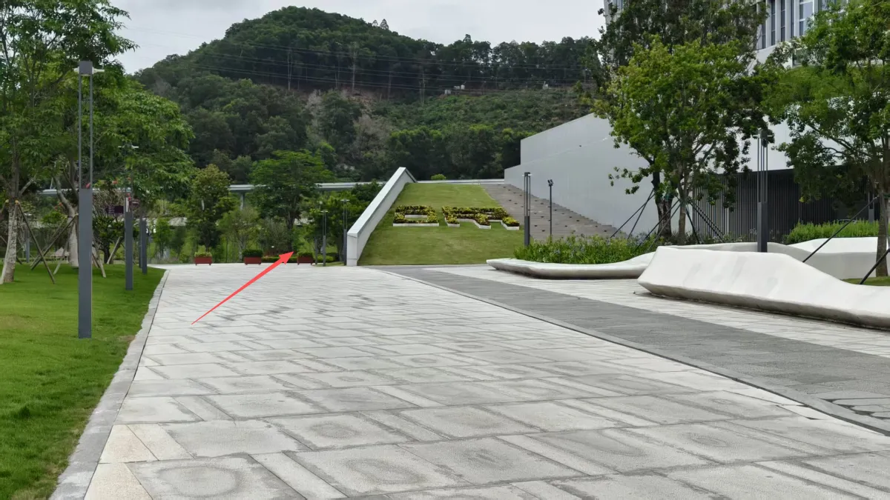
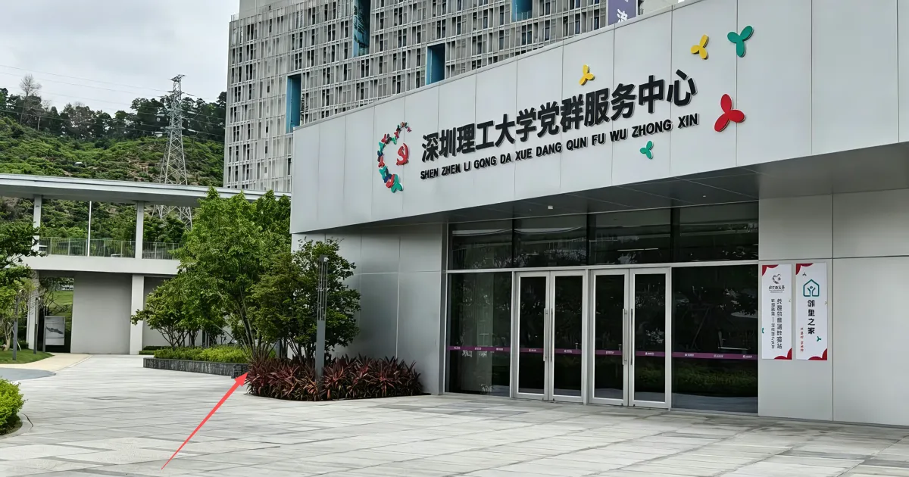
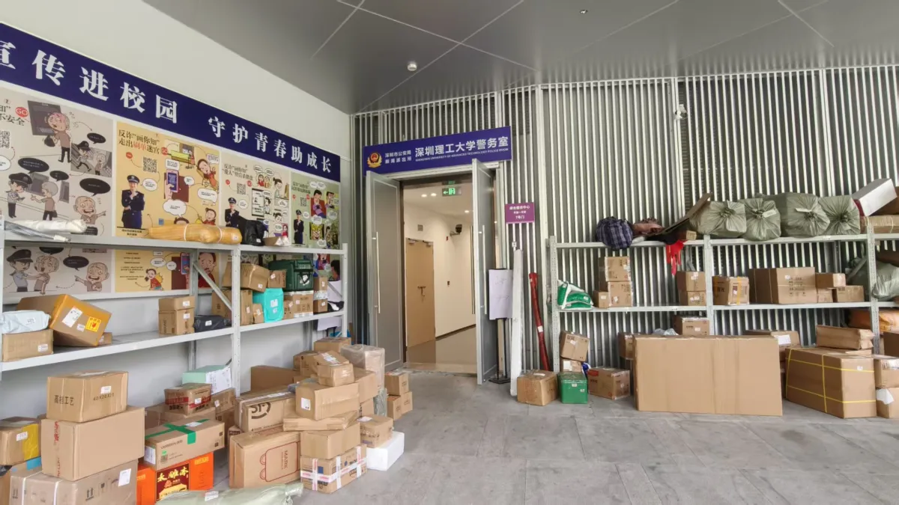

# 快递站位置

校园里的快递站同时也是学校警务处所在位置，按下面三步走即可：

## 第一步：从西门（正大门）进入，沿主路

从深圳理工大学**西门即正门**进入校园，沿主路走到阶梯，**阶梯左侧**就是要走的方向（如图箭头处）。

## 第二步：从党群服务中心右侧入口进入

走到**深圳理工大学党群服务中心**，从其**右侧**进去（如图箭头处）。

## 第三步：到达快递站（即学校警务处）

进去就是快递站，同时也是**学校警务处**所在位置，凭取件码取件即可。如果一不小心拿错了快递，和告诉工作人员即可，他会处理。

