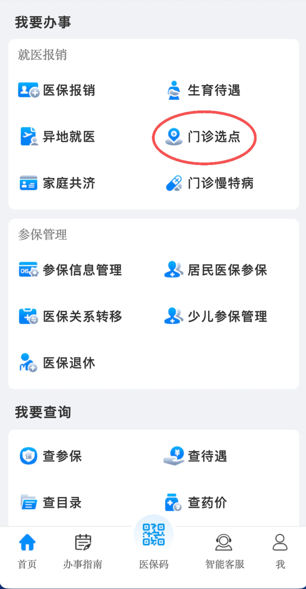

# 校医院及医保相关

目前校医院还是类似于高中里面的那种诊所的形式，**校医院目前是没有医保门诊报销的**。

深圳理工大学总医院和你绑定的社康有，但是需要自己坐地铁去。

## 位置

天枢 3 号楼一楼后侧，就是八分饱旁边那栋楼。

## 值班时间

| 日期          | 时间         |
| ------------- | ------------ |
| 周一至周五    | 9:00 – 18:00 |
| 周末 / 节假日 | 暂无固定值班 |

## 下班后怎么办

如果医生已经下班，但身体确实不舒服：

- 拨打**医务室门口张贴的电话**摇人
- 医生就住在楼上，能及时下来处理

:::info
紧急情况（突发剧痛、高烧不退、外伤等）请直接拨打 **120**，不要硬等到第二天。
:::

---

## 大学生医保

深圳所有全日制普通高校（含公办、民办、中外合作办学院校及科研院所全日制学历生）执行**全市统一的大学生医保政策**，本质为深圳市居民基本医保（学生类）。所有院校缴费标准、报销待遇、就医规则完全一致，学校仅负责统一代办参保手续。

### 一、参保范围

1. 参保门槛：所有全日制在校生均可直接参保。
2. 除外情形：非全日制、继续教育、在职研究生、短期交换生不纳入学校统一参保范围。

### 二、缴费标准（2026-2027 医保年度，2026.9-2027.8）

- 缴费基数：6760 元/月（深圳市上上年度城镇居民月可支配收入）
- 总费率 1.8%：个人承担 0.6%，财政补贴 1.2%
- 个人缴费：40.56 元/月，全年合计**486.72 元/人**
- 缴费方式：每年 9 月开学季由学校随学费统一代扣，一次性缴纳全学年费用；困难学生（低保、特困、孤儿等）可申请个人缴费全额财政减免。

### 三、门诊就医与报销规则

#### 核心前提：绑定基层社康

普通门诊统筹报销**必须先绑定 1 家定点社康中心**，未绑定无法享受门诊统筹报销，全部自费。

注意目前去离学校最近的**中山附七医院是没办法门诊报销的**，因为附七下面没有可以绑定的社康。住院报销是可以的。

- 绑定以及换绑渠道：粤省事、深圳医保微信小程序；**当月换社康次月才生效**。
  如下图在深圳医保的掌上办事中选择 门诊选点 更换社康：

  

  

  

#### 报销比例（医保目录内费用）

- 一级医疗机构/社康：**统筹报销 75%**，个人自付 25%，刷电子医保凭证实时结算
- 二级医院：报销 65%
- 三级医院：报销 55%

### 四、住院就医与报销规则

1. 结算方式：深圳市内所有定点医院住院**无需转诊**，入院出示身份证/电子医保凭证，出院直接实时结算，仅支付自付部分。
2. 起付线（起付线以下全额自费）：
   - 一级医院：300 元
   - 二级医院：400 元
   - 三级医院：500 元
3. 报销比例：起付线以上目录内费用，统筹报销 70%~90%，医院等级越低报销比例越高。
4. 年度封顶线：基本医保统筹年度最高支付限额**48 万元**；叠加大病保险，高额自付费用可二次报销。
