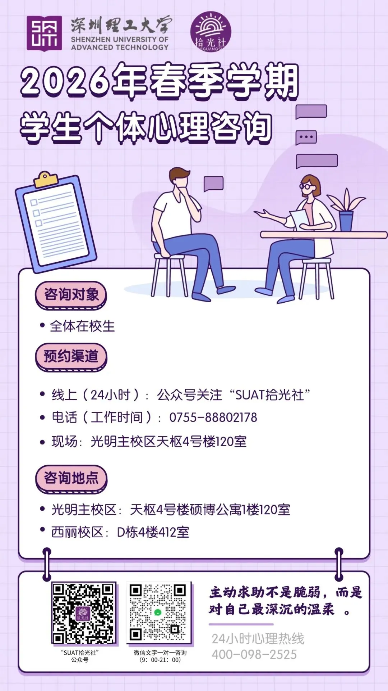
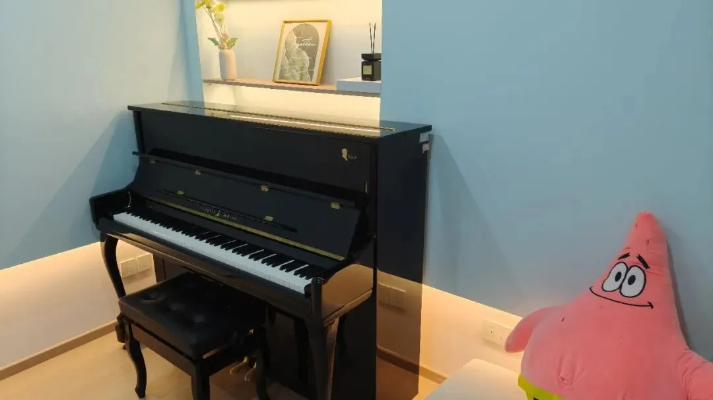

# 深理工心理资源

## 心理资源服务信息

- **服务对象**：深理工全体在校学生
- **预约方式**：关注「SUAT 拾光社」公众号 → 选择咨询预约 → 登录预约系统 → 选择咨询师和合适的时段
- **服务时间**：周一至周日，具体请参考预约系统上的开放时段
- **咨询地点**：
  - 光明：天枢 4 号楼 120 室
  - 西丽：D 栋 412 室

## 常见困惑解答

### 一、什么情况可以来心理咨询？

如果最近你感觉有些压力、情绪起伏，在学习、生活或人际中有一些困惑，对未来感到不太确定，或者只是想找一个安全、安静的空间，和专业老师聊一聊、整理一下自己的状态，都可以预约心理咨询。

心理咨询不仅是在遇到困难时提供支持，也是一种更好了解自己、照顾自己的方式。

### 二、咨询内容会被老师或同学知道吗？

不会。心理咨询遵循严格的保密原则，咨询内容不会进入学籍档案，也不会影响评奖评优或其他学业事务。

你可以在一个安全、被尊重的环境里自由表达。

### 三、第一次咨询会做什么？会不会很尴尬？

第一次咨询通常是了解你的近况和想法。没有标准答案，也不需要提前准备。你可以从最近让你在意的一件小事讲起，我们会慢慢一起梳理。

沉默、停顿、思考，都是被允许的。

### 四、可以只来一次或者每周都来吗？

可以。一次单元咨询或固定周期的咨询需求都是被允许和接纳的。心理咨询并不强制次数，你可以根据自己的需要决定是否继续。我们尊重你的节奏。
